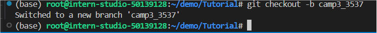
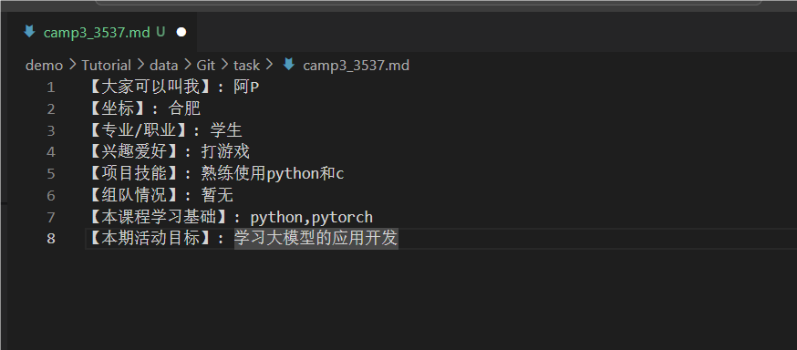
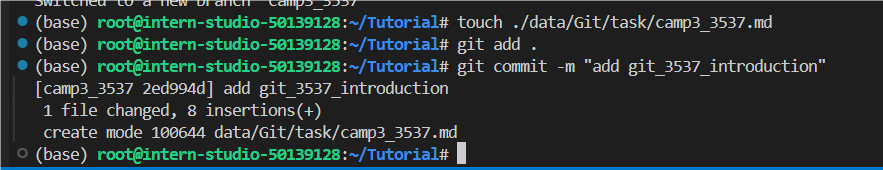
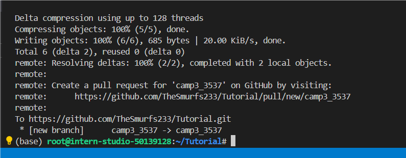
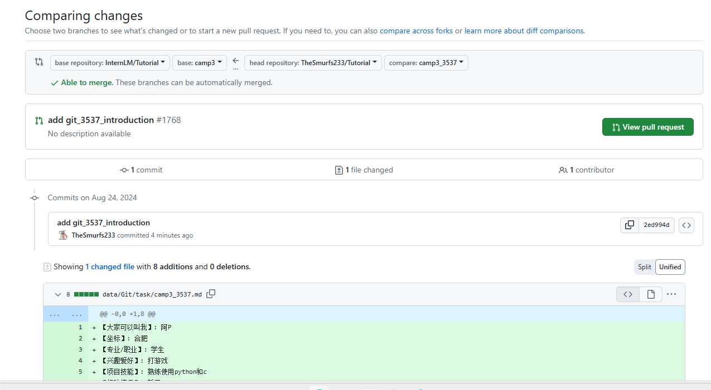

## Git操作

**查看全局配置**

git config --global --list

**查看仓库配置**

git config --local --list

**查看特定配置项**

git config user.name
git config user.email

### Git 四步曲

**添（Add）**

- **命令**：`git add <文件名>` 或 `git add .`
- **作用**：将修改过的文件添加到本地暂存区（Staging Area）。这一步是准备阶段，你可以选择性地添加文件，决定哪些修改应该被包括在即将进行的提交中。

**提（Commit）**

- **命令**：`git commit -m '描述信息'`
- **作用**：将暂存区中的更改提交到本地仓库。这一步是将你的更改正式记录下来，每次提交都应附带一个清晰的描述信息，说明这次提交的目的或所解决的问题。

**拉（Pull）**

- **命令**：`git pull`
- **作用**：从远程仓库拉取最新的内容到本地仓库，并自动尝试合并到当前分支。这一步是同步的重要环节，确保你的工作基于最新的项目状态进行。在多人协作中，定期拉取可以避免将来的合并冲突。

**推（Push）**

- **命令**：`git push`
- **作用**：将本地仓库的更改推送到远程仓库。这一步是共享你的工作成果，让团队成员看到你的贡献。

## 任务1: 破冰活动：自我介绍

- **创建自己的破冰文件**

**写一份自我介绍**

- **提交更改到分支**

PR 到 Tutorial

