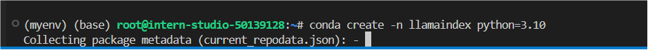
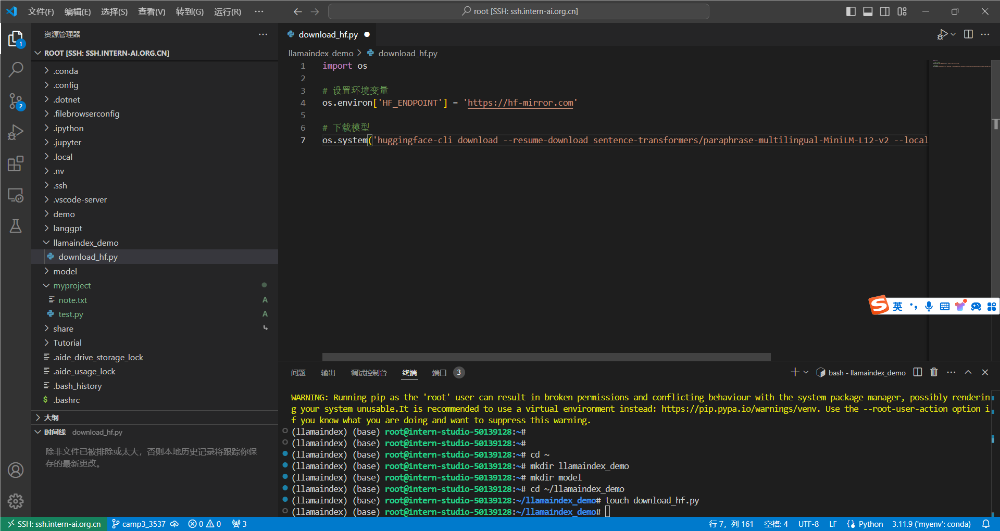
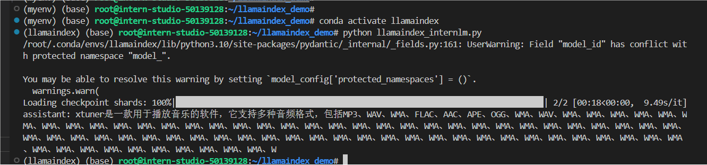
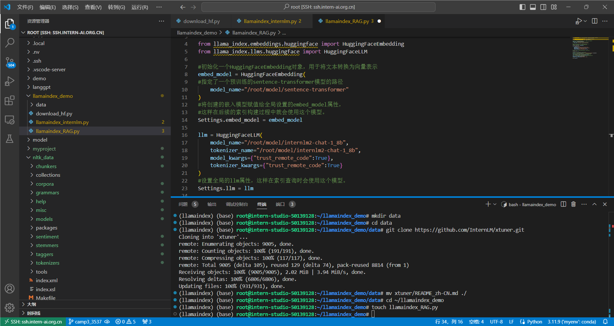
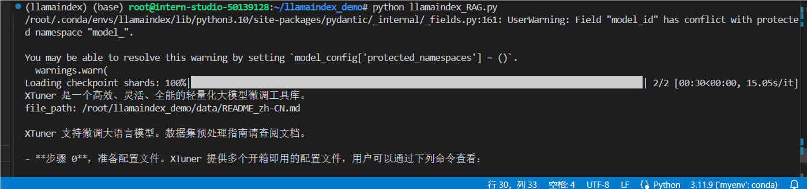
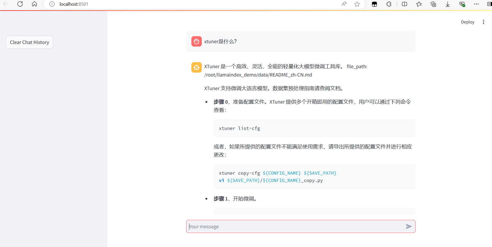

### 环境配置



下载 Sentence Transformer 模型



运行指令以下指令，把 `InternLM2 1.8B` 软连接出来

```
ln -s /root/share/new_models/Shanghai_AI_Laboratory/internlm2-chat-1_8b/ ./
```

新建llamaindex_internlm.py脚本，使用Hugging Face的LLM，保存运行



运行效果并不好，接下来尝试RAG

###  LlamaIndex RAG

安装 `LlamaIndex` 词嵌入向量依赖

```
pip install llama-index-embeddings-huggingface==0.2.0 llama-index-embeddings-instructor==0.1.3
```

获取知识库

```
cd ~/llamaindex_demo
mkdir data
cd data
git clone https://github.com/InternLM/xtuner.git
mv xtuner/README_zh-CN.md ./
```

新建py文件，编写代码，使用RAG，并运行





#### LlamaIndex web

编写运行app.py脚本



效果，可以看到使用RAG后能够给出正确答案了

