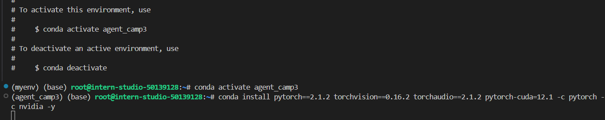
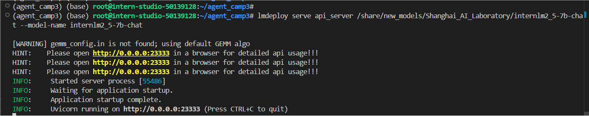
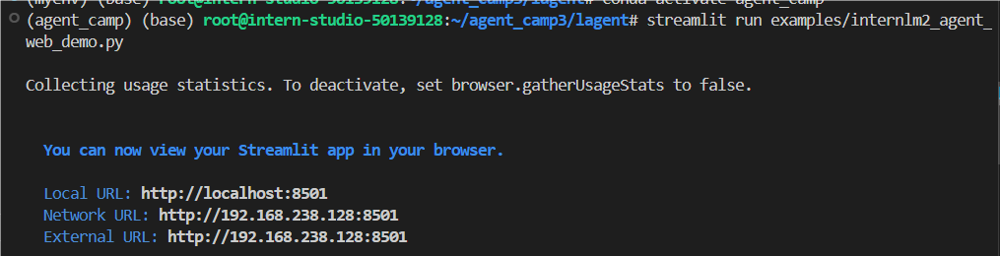
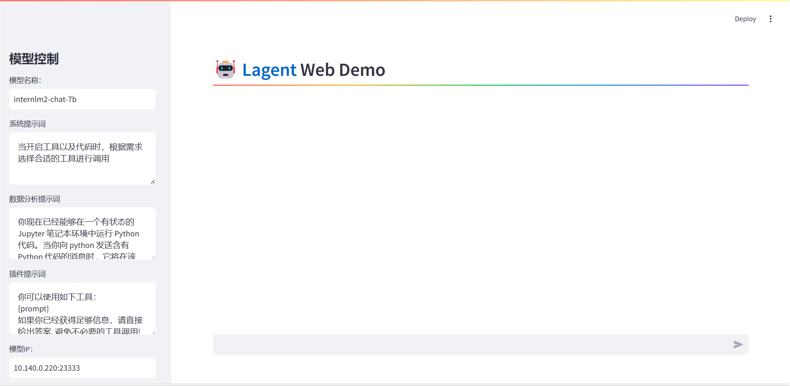
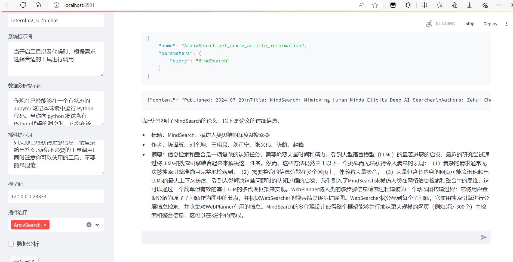
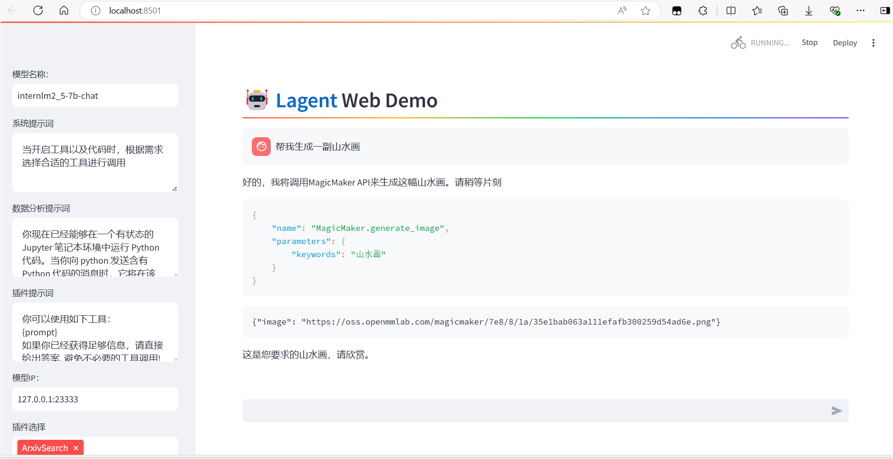
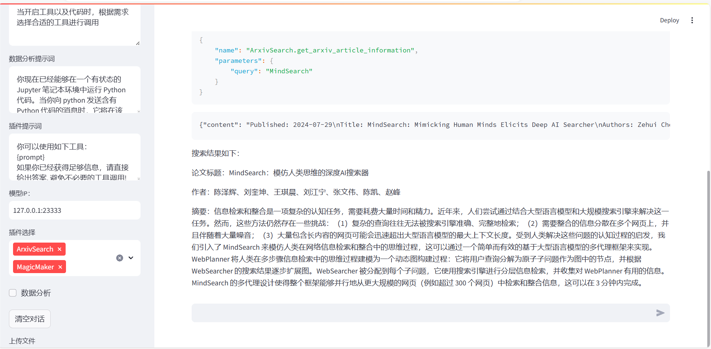

### Lagent 介绍

Lagent 是一个轻量级开源智能体框架，旨在让用户可以高效地构建基于大语言模型的智能体。同时它也提供了一些典型工具以增强大语言模型的能力。

### 环境配置

配置conda、安装torch和其他依赖



通过源码安装的方式安装 lagent

```
# 创建目录以存放代码
mkdir -p /root/agent_camp3
cd /root/agent_camp3
git clone https://github.com/InternLM/lagent.git
cd lagent && git checkout 81e7ace && pip install -e . && cd ..
```

### Lagent Web Demo 使用

首先，使用 LMDeploy 部署 InternLM2.5-7B-Chat，并启动一个 API Server

```
lmdeploy serve api_server /share/new_models/Shanghai_AI_Laboratory/internlm2_5-7b-chat --model-name internlm2_5-7b-chat
```



然后，在另一个窗口中启动 Lagent 的 Web Demo

```
cd /root/agent_camp3/lagent
conda activate agent_camp3
streamlit run examples/internlm2_agent_web_demo.py
```



按文档流程会遇到ModuleNotFoundError: No module named 'griffe.enumerations'的问题，原因是griffe的版本过高，需要安装低版本pip install griffe==0.48

成功打开



接下来，在本地浏览器中打开 `localhost:8501`，并修改**模型名称**一栏为 `internlm2_5-7b-chat`，修改**模型 ip**一栏为`127.0.0.1:23333`

模型输出



### 基于 Lagent 自定义智能体

接下来自定义自己的智能体

使用 Lagent 自定义工具主要分为以下几步：

1. 继承 `BaseAction` 类
2. 实现简单工具的 `run` 方法；或者实现工具包内每个子工具的功能
3. 简单工具的 `run` 方法可选被 `tool_api` 装饰；工具包内每个子工具的功能都需要被 `tool_api` 装饰

下面我们将实现一个调用 MagicMaker API 以完成文生图的功能。

首先创建工具文件

```
cd /root/agent_camp3/lagent
touch lagent/actions/magicmaker.py
```

然后复制代码到magicmaker.py中

最后修改 `/root/agent_camp3/lagent/examples/internlm2_agent_web_demo.py` 来适配我们的自定义工具

启动Web Demo

输出



只给出了一个链接，没有直接展示出来


搜索论文

