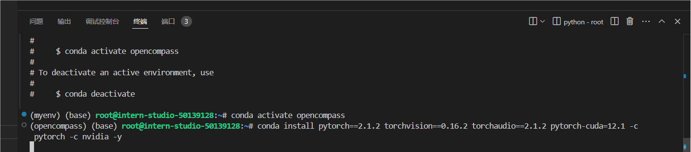
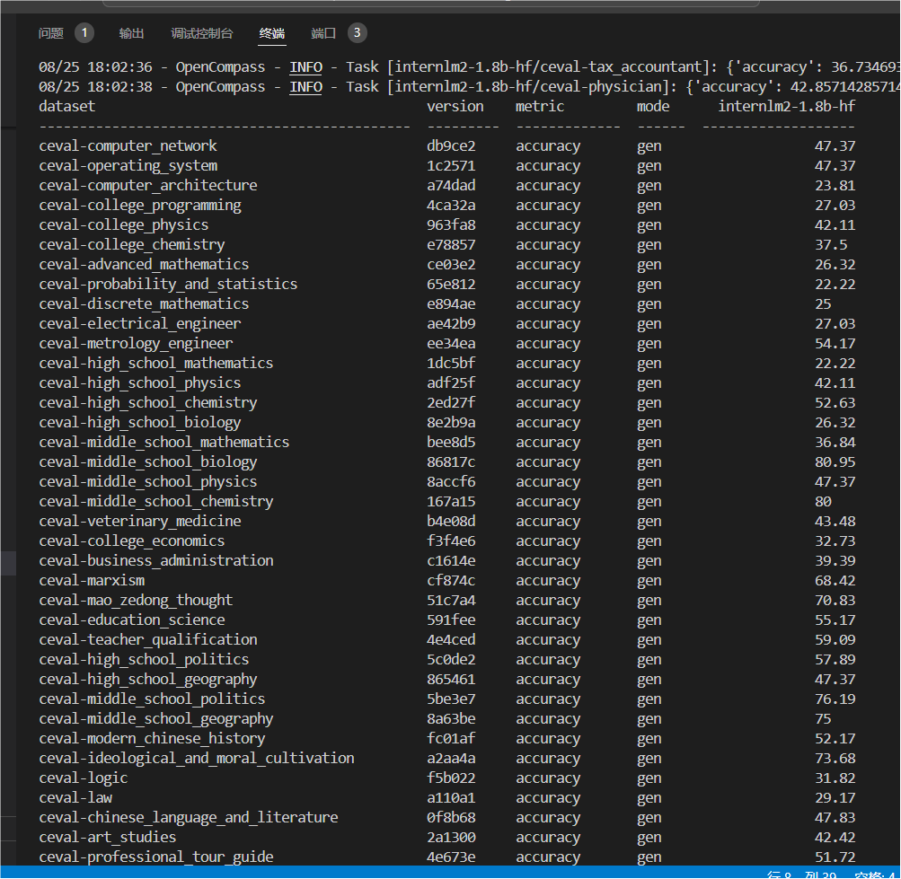
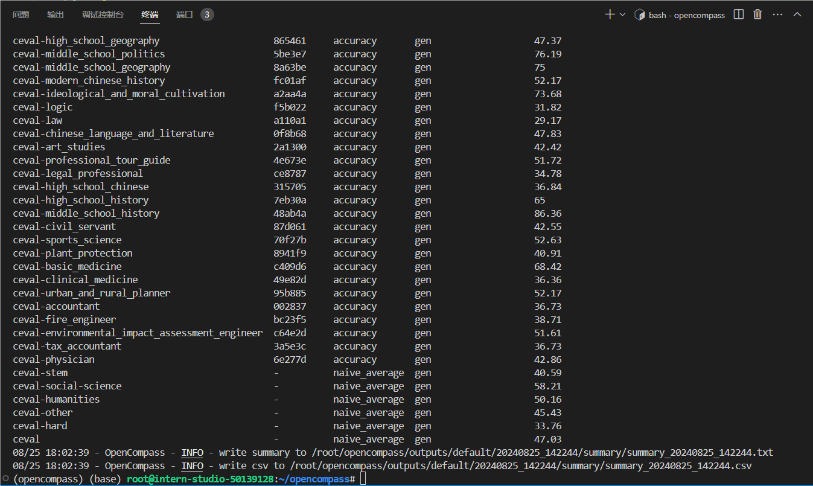
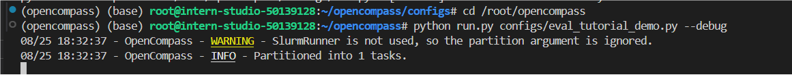

## 使用 OpenCompass 来评测 InternLM2 1.8B

### 环境配置

配置conda 安装依赖···

```
conda create -n opencompass python=3.10
conda activate opencompass
conda install pytorch==2.1.2 torchvision==0.16.2 torchaudio==2.1.2 pytorch-cuda=12.1 -c pytorch -c nvidia -y

# 注意：一定要先 cd /root
cd /root
git clone -b 0.2.4 https://github.com/open-compass/opencompass
cd opencompass
pip install -e .


apt-get update
apt-get install cmake
pip install -r requirements.txt
pip install protobuf
```



### 数据准备

解压评测数据集到 `/root/opencompass/data/` 处

### 启动评测

打开 opencompass文件夹下configs/models/hf_internlm/的`hf_internlm2_chat_1_8b.py`,输入代码

运行以下命令进行评测

```
python run.py --datasets ceval_gen --models hf_internlm2_chat_1_8b --debug
```

评测完成后输出：





其次是使用配置文件修改参数法进行评测

配置文件是以 Python 格式组织的，并且必须包括 datasets 和 models 字段。

