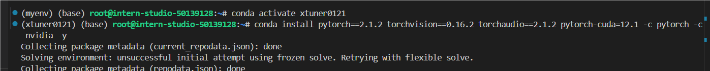
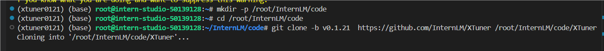
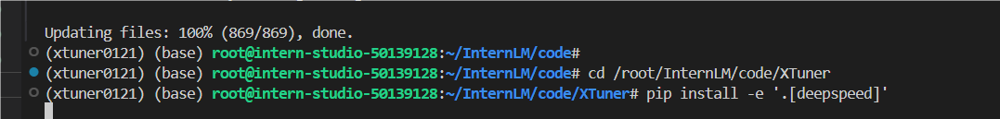
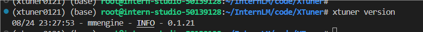
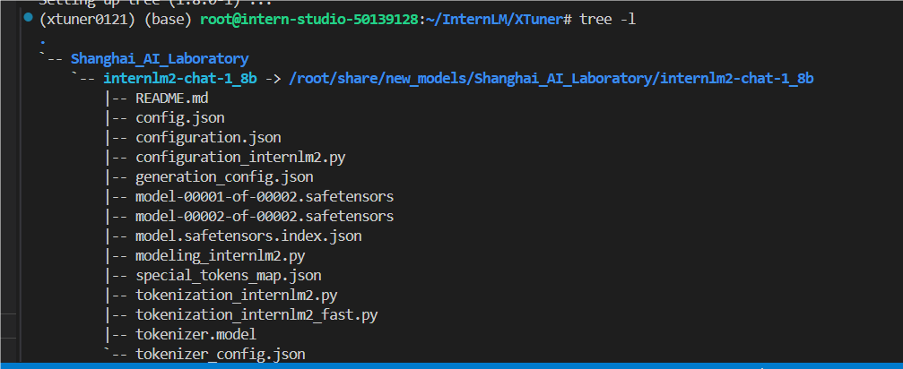
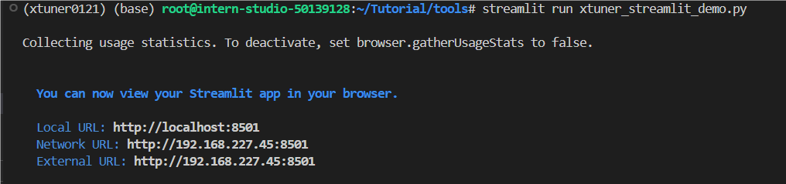
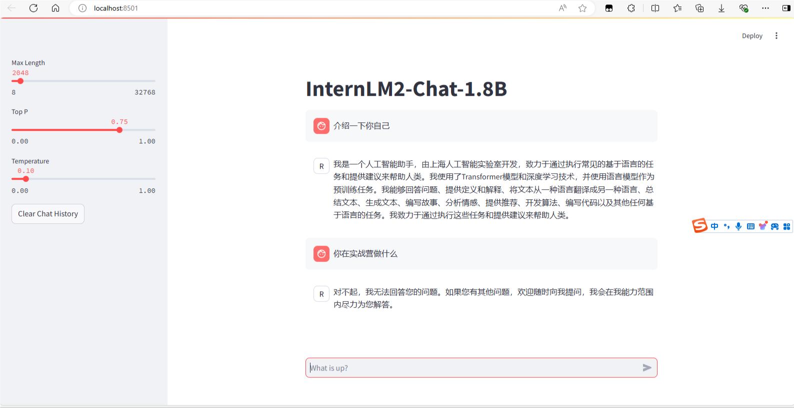
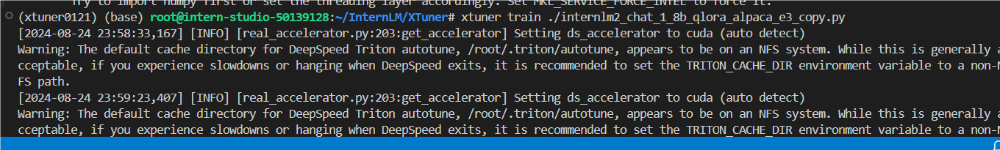
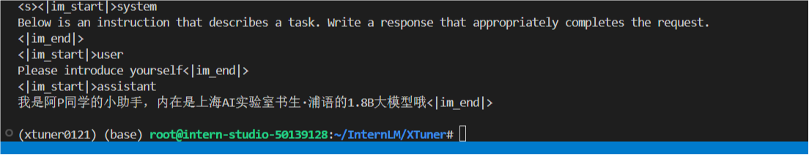
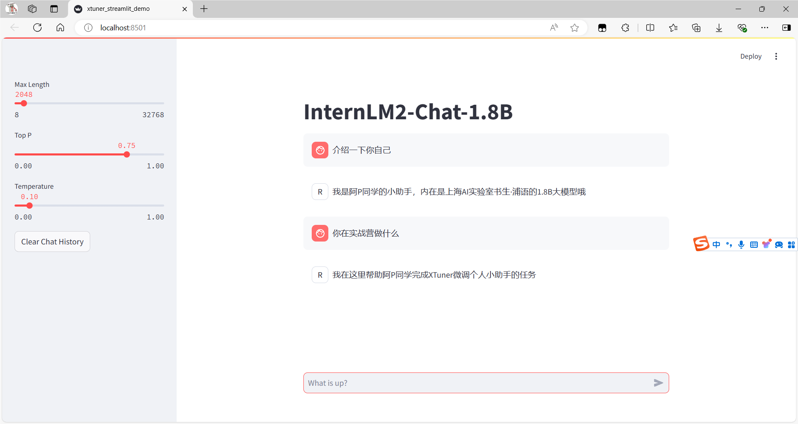

### 虚拟环境配置

```
conda create -n xtuner0121 python=3.10 -y
conda install pytorch==2.1.2 torchvision==0.16.2 torchaudio==2.1.2 pytorch-cuda=12.1 -c pytorch -c nvidia -y
pip install transformers==4.39.3
pip install streamlit==1.36.0
```



### 安装XTuner

创建文件夹，下载源码并安装

```
mkdir -p /root/InternLM/code
cd /root/InternLM/code
git clone -b v0.1.21  https://github.com/InternLM/XTuner /root/InternLM/code/XTuner
cd /root/InternLM/code/XTuner
pip install -e '.[deepspeed]'
```





安装成功



### 模型准备

通过符号链接的方式链接到模型文件

```
mkdir -p /root/InternLM/XTuner

cd /root/InternLM/XTuner

mkdir -p Shanghai_AI_Laboratory

ln -s /root/share/new_models/Shanghai_AI_Laboratory/internlm2-chat-1_8b Shanghai_AI_Laboratory/internlm2-chat-1_8b
```

执行上述操作后，`Shanghai_AI_Laboratory/internlm2-chat-1_8b` 将直接成为一个符号链接，这个链接指向 `/root/share/new_models/Shanghai_AI_Laboratory/internlm2-chat-1_8b` 的位置。

这意味着，当我们访问 `Shanghai_AI_Laboratory/internlm2-chat-1_8b` 时，实际上就是在访问 `/root/share/new_models/Shanghai_AI_Laboratory/internlm2-chat-1_8b` 目录下的内容。通过这种方式，我们无需复制任何数据，就可以直接利用现有的模型文件进行后续的微调操作，从而节省存储空间并简化文件管理。

##### 目录结构



### 微调前的模型对话

通过 `QLoRA` 的方式来微调一个自己的小助手认知作为案例

##### 微调前的模型对话

运行streamlit run xtuner_streamlit_demo.py ，在本地通过浏览器访问：[http://127.0.0.1:8501](http://127.0.0.1:8501/) 来进行对话



浏览器打开，尝试对话



##### 指令跟随微调

准备一个数据集文件`datas/assistant.json`

```
cd /root/InternLM/XTuner
mkdir -p datas
touch datas/assistant.json
```

输入脚本内容，根据自己的想法修改内容并保存

接着执行该脚本来生成数据文件

```
cd /root/InternLM/XTuner
conda activate xtuner0121

python xtuner_generate_assistant.py
```

#### 准备配置文件

##### 列出支持的配置文件

```
xtuner list-cfg -p internlm2
```

复制一个预设的配置文件

最匹配的配置文件是 `internlm2_chat_1_8b_qlora_alpaca_e3`

```
xtuner copy-cfg internlm2_chat_1_8b_qlora_alpaca_e3 .
```

##### 修改配置文件

预训练模型的选择、数据集信息和训练过程中的一些基本参数（如批大小、学习率等）

##### 启动微调

使用 `xtuner train` 命令令开始训练

```
xtuner train ./internlm2_chat_1_8b_qlora_alpaca_e3_copy.py
```



训练完成



##### 模型格式转换

将原本使用 Pytorch 训练出来的模型权重文件转换为目前通用的 HuggingFace 格式文件

```
# 先获取最后保存的一个pth文件
pth_file=`ls -t ./work_dirs/internlm2_chat_1_8b_qlora_alpaca_e3_copy/*.pth | head -n 1`
export MKL_SERVICE_FORCE_INTEL=1
export MKL_THREADING_LAYER=GNU
xtuner convert pth_to_hf ./internlm2_chat_1_8b_qlora_alpaca_e3_copy.py ${pth_file} ./hf
```

##### 模型合并

对于 LoRA 或者 QLoRA 微调出来的模型其实并不是一个完整的模型，而是一个额外的层（Adapter），训练完的这个层最终还是要与原模型进行合并才能被正常的使用。

```
export MKL_SERVICE_FORCE_INTEL=1
export MKL_THREADING_LAYER=GNU
xtuner convert merge /root/InternLM/XTuner/Shanghai_AI_Laboratory/internlm2-chat-1_8b ./hf ./merged --max-shard-size 2GB
```

##### 微调后的模型对话

再次运行脚本，尝试与微调后的模型进行对话



微调成功！