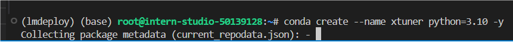
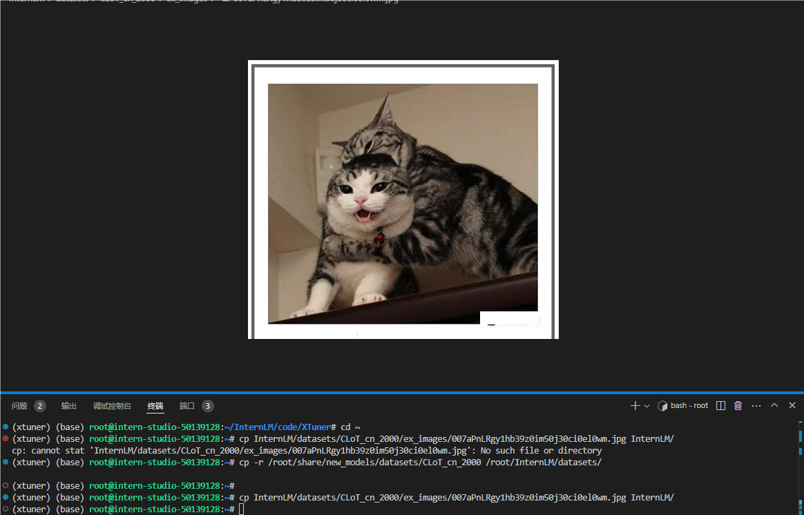
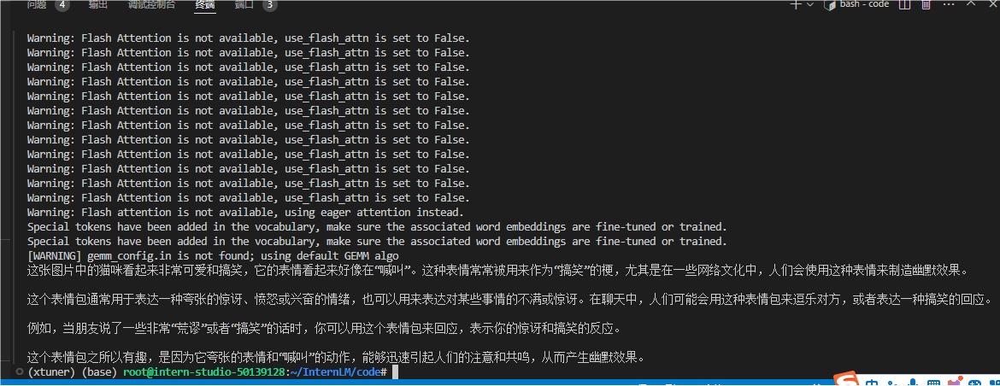
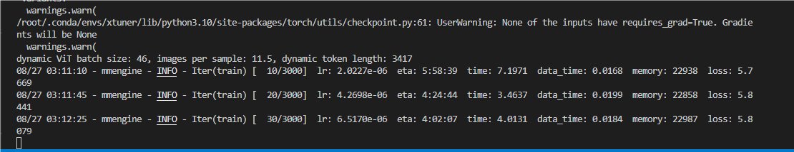
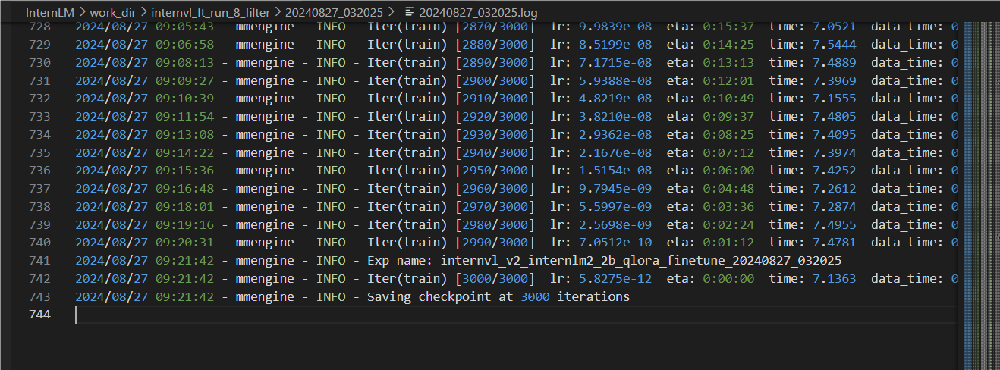
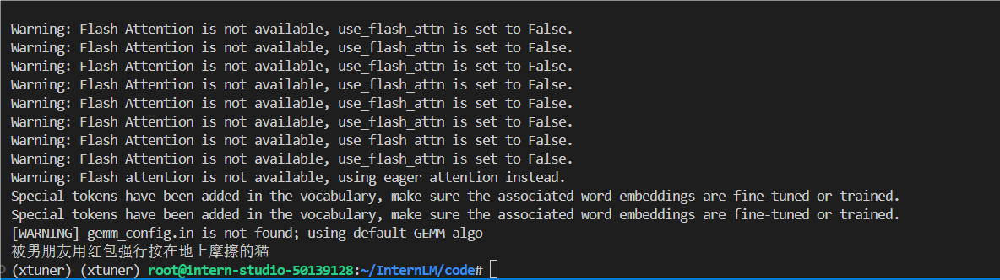
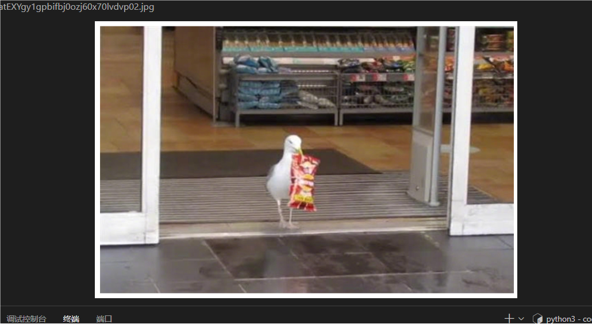
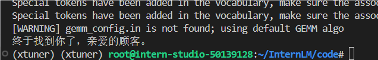
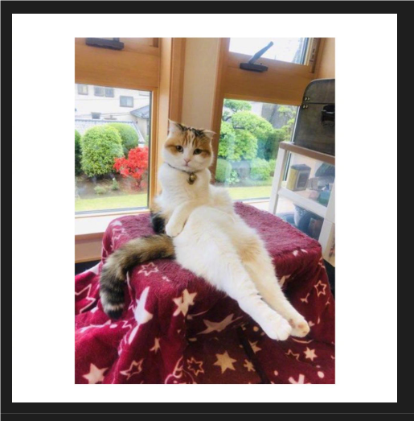
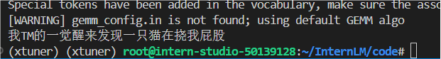

## 什么是InternVL

InternVL 是一种用于多模态任务的深度学习模型，旨在处理和理解多种类型的数据输入，如图像和文本。它结合了视觉和语言模型，能够执行复杂的跨模态任务，比如图文匹配、图像描述生成等。通过整合视觉特征和语言信息，InternVL 可以在多模态领域取得更好的表现

## InternVL 部署微调实践

让InternVL-2B生成文生图提示词，这个任务需要VLM对图片有格式化的描述并输出。

在这里，我们微调InterenVL使用xtuner。部署InternVL使用lmdeploy。

### 准备InternVL模型

把share文件夹下的InternVL2-2B模型移动到目标文件夹

```
cd /root
mkdir -p model

# cp 模型

cp -r /root/share/new_models/OpenGVLab/InternVL2-2B /root/model/
```

### 准备环境

配置conda、xtuner、lmdeploy及其他依赖



···

### 准备InternVL模型

我们使用InternVL2-2B模型。该模型已在share文件夹下挂载好，现在让我们把移动出来。

```
cd /root
mkdir -p model

# cp 模型

cp -r /root/share/new_models/OpenGVLab/InternVL2-2B /root/model/
```

### 准备微调数据集

数据集我们从官网下载下来并进行去重，只保留中文数据等操作。并制作成XTuner需要的形式。并已在share里，我们一起从share里挪出数据集。

```
## 首先让我们安装一下需要的包
pip install datasets matplotlib Pillow timm

## 让我们把数据集挪出来
cp -r /root/share/new_models/datasets/CLoT_cn_2000 /root/InternLM/datasets/
```

打开数据集的一张图看看

```
cp InternLM/datasets/CLoT_cn_2000/ex_images/007aPnLRgy1hb39z0im50j30ci0el0wm.jpg InternLM/
```



### InternVL 推理部署攻略

没有进行微调

#### 使用pipeline进行推理

之后我们使用lmdeploy自带的pipeline工具进行开箱即用的推理流程，首先我们新建一个文件。

```
touch /root/InternLM/code/test_lmdeploy.py
cd /root/InternLM/code/
```

粘入代码，运行执行推理结果。

```
python3 test_lmdeploy.py
```

推理结果



直接使用2b模型不能很好的讲出梗，现在我们要对这个2b模型进行微调

### InternVL 微调攻略

#### 准备数据集

数据集格式为：

```
# 为了高效训练，请确保数据格式为：
{
    "id": "000000033471",
    "image": ["coco/train2017/000000033471.jpg"], # 如果是纯文本，则该字段为 None 或者不存在
    "conversations": [
      {
        "from": "human",
        "value": "<image>\nWhat are the colors of the bus in the image?"
      },
      {
        "from": "gpt",
        "value": "The bus in the image is white and red."
      }
    ]
  }
```

#### 配置微调参数

/root/InternLM/code/XTuner/xtuner/configs/internvl/v2/internvl_v2_internlm2_2b_qlora_finetune.py

修改上面路径下的文件

#### 开始训练

```
NPROC_PER_NODE=1 xtuner train /root/InternLM/code/XTuner/xtuner/configs/internvl/v2/internvl_v2_internlm2_2b_qlora_finetune.py  --work-dir /root/InternLM/work_dir/internvl_ft_run_8_filter  --deepspeed deepspeed_zero1
```

训练ing



训练完成



#### 合并权重&&模型转换

```
python3 xtuner/configs/internvl/v1_5/convert_to_official.py xtuner/configs/internvl/v2/internvl_v2_internlm2_2b_qlora_finetune.py /root/InternLM/work_dir/internvl_ft_run_8_filter/iter_3000.pth /root/InternLM/InternVL2-2B/
```

### 微调后效果对比

把下面的代码替换进test_lmdeploy.py中，然后跑一下效果。

```
from lmdeploy import pipeline
from lmdeploy.vl import load_image

pipe = pipeline('/root/InternLM/InternVL2-2B')

image = load_image('/root/InternLM/007aPnLRgy1hb39z0im50j30ci0el0wm.jpg')
response = pipe(('请你根据这张图片，讲一个脑洞大开的梗', image))
print(response.text)
```

输出



再试一个





再试一个




