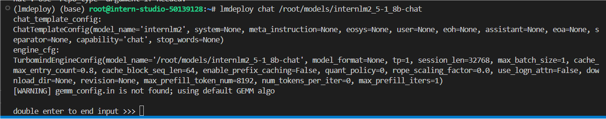

### 环境配置

创建一个名为lmdeploy的conda环境，python版本为3.10，创建成功后激活环境并安装0.5.3版本的lmdeploy及相关包。

```Plain
conda create -n lmdeploy  python=3.10 -y
conda activate lmdeploy
conda install pytorch==2.1.2 torchvision==0.16.2 torchaudio==2.1.2 pytorch-cuda=12.1 -c pytorch -c nvidia -y
pip install timm==1.0.8 openai==1.40.3 lmdeploy[all]==0.5.3
```

### 获取模型


量化作业请使用internlm2_5-1_8b-chat模型完成

##### 验证启动模型文件

```Plain
lmdeploy chat /root/models/internlm2_5-1_8b-chat
```




启动成功

查询显存占用


### LMDeploy与InternLM2.5

将大模型封装为API接口服务，供客户端访问

##### 启动API服务器

通下命令启动API服务器，部署InternLM2.5模型

```Plain
conda activate lmdeploy
lmdeploy serve api_server \
    /root/models/internlm2_5-1_8b-chat \
    --model-format hf \
    --quant-policy 0 \
    --server-name 0.0.0.0 \
    --server-port 23333 \
    --tp 1
```

命令解释：

1. `lmdeploy serve api_server`：这个命令用于启动API服务器。
2. `/root/models/internlm2_5-7b-chat`：这是模型的路径。
3. `--model-format hf`：这个参数指定了模型的格式。`hf`代表“Hugging Face”格式。
4. `--quant-policy 0`：这个参数指定了量化策略。
5. `--server-name 0.0.0.0`：这个参数指定了服务器的名称。在这里，`0.0.0.0`是一个特殊的IP地址，它表示所有网络接口。
6. `--server-port 23333`：这个参数指定了服务器的端口号。在这里，`23333`是服务器将监听的端口号。
7. `--tp 1`：这个参数表示并行数量（GPU数量）。


##### 以命令行形式连接API服务器

新建终端

```
lmdeploy serve api_client http://localhost:23333
```


成功连接

#####  以Gradio**网页形式连接API服务器**

新建终端输入以下命令，使用Gradio作为前端，启动网页

```
lmdeploy serve gradio http://localhost:23333 \
    --server-name 0.0.0.0 \
    --server-port 6006
```


连接成功

### LMDeploy Lite

随着模型变得越来越大，我们需要一些大模型压缩技术来降低模型部署的成本，并提升模型的推理性能。LMDeploy 提供了权重量化和 k/v cache两种策略。

##### **设置最大kv cache缓存大小**

kv cache是一种缓存技术，通过存储键值对的形式来复用计算结果，以达到提高性能和降低内存消耗的目的。在大规模训练和推理中，kv cache可以显著减少重复计算量，从而提升模型的推理速度。理想情况下，kv cache全部存储于显存，以加快访存速度。

模型在运行时，占用的显存可大致分为三部分：模型参数本身占用的显存、kv cache占用的显存，以及中间运算结果占用的显存。LMDeploy的kv cache管理器可以通过设置`--cache-max-entry-count`参数，控制kv缓存占用**剩余显存**的最大比例。默认的比例为0.8。

执行以下命令，再查看显存占用

```
lmdeploy chat /root/models/internlm2_5-7b-chat --cache-max-entry-count 0.4
```


可以发现相对于之前20G的显存，现在只有12G了

#####  设置**在线** kv cache int4/int8 量化

自 v0.4.0 起，LMDeploy 支持在线 kv cache int4/int8 量化，量化方式为 per-head per-token 的非对称量化。此外，通过 LMDeploy 应用 kv 量化非常简单，只需要设定 `quant_policy` 和`cache-max-entry-count`参数。目前，LMDeploy 规定 `quant_policy=4` 表示 kv int4 量化，`quant_policy=8` 表示 kv int8 量化。

输入以下指令，启动API服务器

```
lmdeploy serve api_server \
    /root/models/internlm2_5-1_8b-chat \
    --model-format hf \
    --quant-policy 4 \
    --cache-max-entry-count 0.4\
    --server-name 0.0.0.0 \
    --server-port 23333 \
    --tp 1
```


可以看到此时显存占用约**12GB**，相较于LMDeploy验证启动模型文件直接启动模型的显存占用情况(**20GB**)减少了**8GB**的占用。此时**8GB**显存的减少逻辑与 设置最大kv cache缓存大小中8GB显存的减少一致，均因设置kv cache占用参数`cache-max-entry-count`至0.4而减少了**8GB**显存占用。

相比使用BF16精度的kv cache，int4的Cache可以在相同**8GB**的显存下只需要4位来存储一个数值，而BF16需要16位。这意味着int4的Cache可以存储的元素数量是BF16的四倍。

##### W4A16 模型量化和部署

准确说，模型量化是一种优化技术，旨在减少机器学习模型的大小并提高其推理速度。量化通过将模型的权重和激活从高精度（如16位浮点数）转换为低精度（如8位整数、4位整数、甚至二值网络）来实现。

那么标题中的W4A16又是什么意思呢？

- W4：这通常表示权重量化为4位整数（int4）。这意味着模型中的权重参数将从它们原始的浮点表示（例如FP32、BF16或FP16，**Internlm2.5精度为BF16**）转换为4位的整数表示。这样做可以显著减少模型的大小。
- A16：这表示激活（或输入/输出）仍然保持在16位浮点数（例如FP16或BF16）。激活是在神经网络中传播的数据，通常在每层运算之后产生。

因此，W4A16的量化配置意味着：

- 权重被量化为4位整数。
- 激活保持为16位浮点数。

让我们回到LMDeploy，在最新的版本中，LMDeploy使用的是AWQ算法，能够实现模型的4bit权重量化。输入以下指令，执行量化工作。**(不建议运行，在InternStudio上运行需要8小时)**

```
lmdeploy lite auto_awq \
   /root/models/internlm2_5-1_8b-chat \
  --calib-dataset 'ptb' \
  --calib-samples 128 \
  --calib-seqlen 2048 \
  --w-bits 4 \
  --w-group-size 128 \
  --batch-size 1 \
  --search-scale False \
  --work-dir /root/models/internlm2_5-1_8b-chat-w4a16-4bit
```

命令解释：

1. `lmdeploy lite auto_awq`: `lite`这是LMDeploy的命令，用于启动量化过程，而`auto_awq`代表自动权重量化（auto-weight-quantization）。
2. `/root/models/internlm2_5-7b-chat`: 模型文件的路径。
3. `--calib-dataset 'ptb'`: 这个参数指定了一个校准数据集，这里使用的是’ptb’（Penn Treebank，一个常用的语言模型数据集）。
4. `--calib-samples 128`: 这指定了用于校准的样本数量—128个样本
5. `--calib-seqlen 2048`: 这指定了校准过程中使用的序列长度—2048
6. `--w-bits 4`: 这表示权重（weights）的位数将被量化为4位。
7. `--work-dir /root/models/internlm2_5-7b-chat-w4a16-4bit`: 这是工作目录的路径，用于存储量化后的模型和中间结果。

终端输出


等待推理完成，便可以直接在你设置的目标文件夹看到对应的模型文件。

那么推理后的模型和原本的模型区别在哪里呢？最明显的两点是模型文件大小以及占据显存大小。

我们可以输入如下指令查看在当前目录中显示所有子目录的大小。

```
cd /root/models/
du -sh *
```

输出结果如下。(其余文件夹都是以软链接的形式存在的，不占用空间，故显示为0)


那么原模型大小,输入以下指令查看。

```
cd /root/share/new_models/Shanghai_AI_Laboratory/
du -sh *
```


那么显存占用情况对比呢？输入以下指令启动量化后的模型。


#####  W4A16 量化+ KV cache+KV cache 量化

输入以下指令，让我们同时启用量化后的模型、设定kv cache占用和kv cache int4量化。

```
lmdeploy serve api_server \
    /root/models/internlm2_5-1_8b-chat-w4a16-4bit/ \
    --model-format awq \
    --quant-policy 4 \
    --cache-max-entry-count 0.4\
    --server-name 0.0.0.0 \
    --server-port 23333 \
    --tp 1
```


##### LMDeploy与InternVL2

通过以下命令启动API服务器，部署InternVL2模型：

```
lmdeploy serve api_server \
    /root/models/InternVL2-26B-w4a16-4bit/ \
    --model-format awq \
    --quant-policy 4 \
    --cache-max-entry-count 0.1 \
    --server-name 0.0.0.0 \
    --server-port 23333 \
    --tp 1
```

### LMDeploy之FastAPI与Function call

#####  API开发

输入指令启动API服务器

```
conda activate lmdeploy
lmdeploy serve api_server \
    /root/models/internlm2_5-1_8b-chat-w4a16-4bit \
    --model-format awq \
    --cache-max-entry-count 0.4 \
    --quant-policy 4 \
    --server-name 0.0.0.0 \
    --server-port 23333 \
    --tp 1
```


新建一个终端,新建`internlm2_5.py`。

```Plain
touch /root/internlm2_5.py
```

输入代码并保存

新建终端输入以下指令激活环境并运行python代码

```
conda activate lmdeploy
python /root/internlm2_5.py
```

终端输出结果，大模型回复正常


显存占用，相对于量化前的20G显存占用相比，量化后显存占用缩小到11G


##### Function call

关于Function call，即函数调用功能，它允许开发者在调用模型时，详细说明函数的作用，并使模型能够智能地根据用户的提问来输入参数并执行函数。完成调用后，模型会将函数的输出结果作为回答用户问题的依据。

首先让我们进入创建好的conda环境并启动API服务器。

```Plain
conda activate lmdeploy
lmdeploy serve api_server \
    /root/models/internlm2_5-7b-chat \
    --model-format hf \
    --quant-policy 0 \
    --server-name 0.0.0.0 \
    --server-port 23333 \
    --tp 1
```

目前LMDeploy在0.5.3版本中支持了对InternLM2, InternLM2.5和llama3.1这三个模型，故我们选用InternLM2.5 封装API。

让我们使用一个简单的例子作为演示。输入如下指令，新建`internlm2_5_func.py`。

粘贴代码并保存，输入以下指令运行python代码。

```
python /root/internlm2_5_func.py
```

输出


大模型成功调用函数

可以看出InternLM2.5将输入`'Compute (3+5)*2'`根据提供的function拆分成了"加"和"乘"两步，第一步调用`function add`实现加，再于第二步调用`function mul`实现乘，再最终输出结果16.